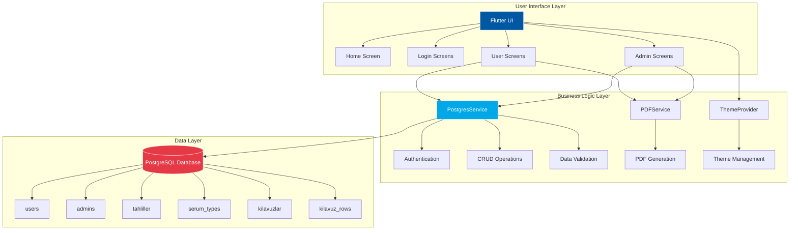
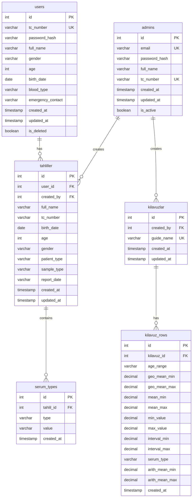
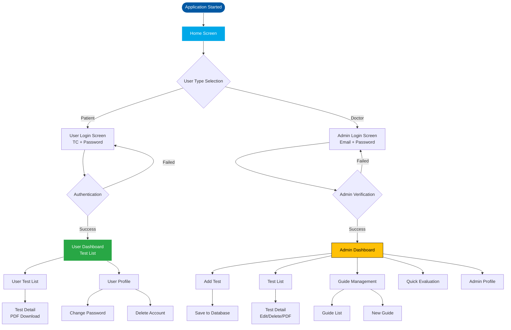
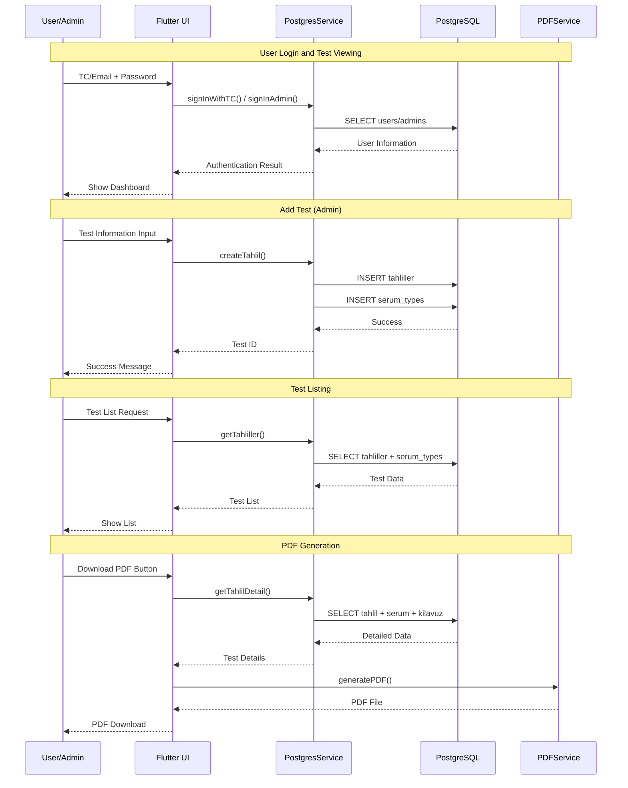
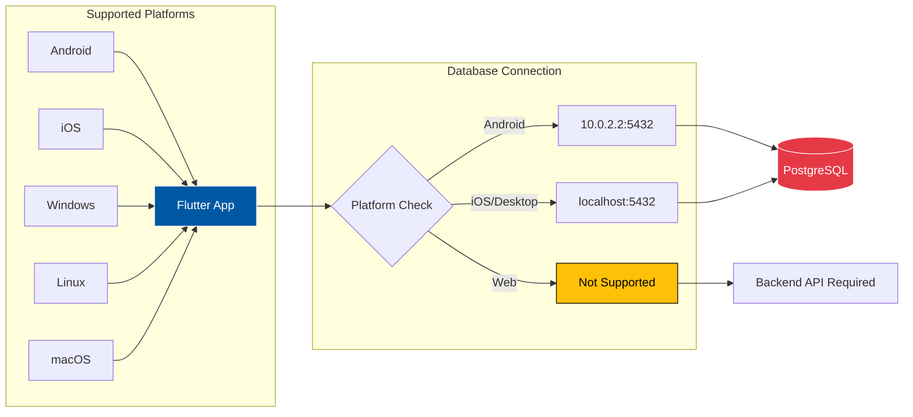

# E-Laboratuvar Sistemi

Bu proje, laboratuvar tahlillerini yönetmek için geliştirilmiş modern bir Flutter uygulamasıdır.

## Özellikler

### Kullanıcı (Hasta) Tarafı
- TC kimlik numarası ile giriş/kayıt
- Geçmiş tahlilleri listeleme
- Tahlil detaylarını görüntüleme
- Profil yönetimi (şifre değiştirme, hesap silme)

### Yönetici (Doktor) Tarafı
- E-posta/şifre ile admin girişi
- Kılavuz oluşturma ve yönetme
- Tahlil ekleme
- Tahlil listeleme ve arama
- Hızlı değerlendirme (doğum tarihi ve serum değerleri ile)

## Sistem Gereksinimleri

### Geliştirme Ortamı
- **Flutter SDK**: ^3.9.0 veya üzeri
- **Dart SDK**: Flutter ile birlikte gelir
- **PostgreSQL**: 12.0 veya üzeri
- **Android Studio** veya **VS Code** (Flutter eklentileri ile)
- **Git**: Versiyon kontrolü için

### Platform Gereksinimleri
- **Android**: API Level 21 (Android 5.0) veya üzeri
- **iOS**: iOS 12.0 veya üzeri
- **Windows**: Windows 10 veya üzeri
- **Linux**: Modern Linux dağıtımları
- **macOS**: macOS 10.14 veya üzeri

### Veritabanı Gereksinimleri
- **PostgreSQL Server**: Yerel veya uzak sunucu
- **Veritabanı Adı**: `elab_system`
- **Port**: 5432 (varsayılan)
- **Kullanıcı İzinleri**: CREATE, INSERT, UPDATE, DELETE, SELECT

## Kurulum

### 1. Flutter SDK Kurulumu

Flutter SDK'nın yüklü olduğundan emin olun. Eğer yüklü değilse:

**Windows:**
```bash
# Flutter SDK'yı indirin ve PATH'e ekleyin
# https://docs.flutter.dev/get-started/install/windows
```

**macOS/Linux:**
```bash
# Flutter SDK'yı indirin ve PATH'e ekleyin
# https://docs.flutter.dev/get-started/install
```

Kurulumu doğrulayın:
```bash
flutter doctor
```

### 2. Proje Klonlama ve Bağımlılıklar

```bash
# Proje klasörüne gidin
cd g211210055_labsystem

# Bağımlılıkları yükleyin
flutter pub get

# Flutter versiyonunu kontrol edin (^3.9.0 gerekli)
flutter --version
```

### 3. PostgreSQL Veritabanı Kurulumu

#### 3.1. PostgreSQL Kurulumu

**Windows:**
- PostgreSQL'i [resmi siteden](https://www.postgresql.org/download/windows/) indirin ve kurun
- Kurulum sırasında `postgres` kullanıcısı için şifre belirleyin

**macOS:**
```bash
brew install postgresql
brew services start postgresql
```

**Linux (Ubuntu/Debian):**
```bash
sudo apt-get update
sudo apt-get install postgresql postgresql-contrib
sudo systemctl start postgresql
```

#### 3.2. Veritabanı Oluşturma

PostgreSQL'e bağlanın:
```bash
# Windows (psql komut satırı aracı)
psql -U postgres

# macOS/Linux
sudo -u postgres psql
```

Veritabanını oluşturun:
```sql
-- Veritabanı oluştur
CREATE DATABASE elab_system;

-- Veritabanına bağlan
\c elab_system
```

#### 3.3. Şema Oluşturma

```bash
# Proje dizininden şema dosyasını çalıştırın
psql -U postgres -d elab_system -f database/schema.sql
```

veya psql içinde:
```sql
\i database/schema.sql
```

#### 3.4. Veritabanı Bağlantı Ayarları

`lib/config/database_config.dart` dosyasını düzenleyin:

```dart
static String get host {
  // Android emülatörü için
  if (Platform.isAndroid) {
    return '10.0.2.2';  // Emülatör için özel IP
  }
  // iOS ve Desktop için
  return 'localhost';
}

static String get password => 'KENDI_SIFRENIZ';  // PostgreSQL şifreniz
```

**Önemli Notlar:**
- Android emülatöründe `localhost` yerine `10.0.2.2` kullanılmalıdır
- iOS simülatöründe `localhost` kullanılabilir
- Desktop platformlarda `localhost` kullanılır
- Web platformunda PostgreSQL bağlantısı desteklenmez (backend API gerekir)

### 4. İlk Admin Kullanıcısı Oluşturma

Veritabanında ilk admin kullanıcısını oluşturun:

```sql
-- PostgreSQL'e bağlanın
psql -U postgres -d elab_system

-- Admin kullanıcısı ekleyin (şifre hash'lenmiş olmalı)
-- SHA256 hash'i oluşturmak için uygulama içinde kayıt yapabilirsiniz
-- veya geçici olarak:
INSERT INTO admins (email, password_hash, full_name, is_active)
VALUES ('admin@example.com', 'geçici_şifre_hash', 'Admin Kullanıcı', true);
```

**Not:** Güvenlik için şifre hash'leme işlemi uygulama tarafından yapılır. İlk admin kullanıcısını uygulama üzerinden kayıt ekranı ile oluşturmanız önerilir.

## Çalıştırma

### Komut Satırı ile Çalıştırma

#### Emülatör Başlatma

Önce mevcut emülatörleri listeleyin:
```bash
flutter emulators
```

Belirli bir emülatörü başlatın (örnek: Pixel_7):
```bash
flutter emulators --launch Pixel_7
```

#### Uygulamayı Çalıştırma

Tüm cihazlarda çalıştırmak için:
```bash
flutter run
```

Belirli bir emülatörde çalıştırmak için:
```bash
flutter run -d emulator-5554
```

Web için:
```bash
flutter run -d chrome
```

**Not:** Emülatör ID'sini öğrenmek için `flutter devices` komutunu kullanabilirsiniz.

### Android Studio ile Çalıştırma

1. **Android Studio'yu Açın**
   - Android Studio'yu başlatın
   - "Open" veya "File > Open" seçeneğini kullanarak proje klasörünü (`g211210055_labsystem`) açın

2. **Flutter Plugin Kontrolü**
   - Android Studio, Flutter projesini algıladığında Flutter ve Dart plugin'lerinin yüklü olduğundan emin olun
   - Eğer yüklü değilse, "File > Settings > Plugins" menüsünden Flutter ve Dart plugin'lerini yükleyin

3. **Bağımlılıkları Yükleyin**
   - Terminal sekmesinde veya Android Studio'nun alt kısmındaki terminal'de şu komutu çalıştırın:
     ```bash
     flutter pub get
     ```
   - Eğer web platformu için ek bağımlılıklar gerekiyorsa:
     ```bash
     npm install expo-document-picker
     ```

4. **Emülatör Kurulumu ve Başlatma**
   - Mevcut emülatörleri listelemek için:
     ```bash
     flutter emulators
     ```
   - Belirli bir emülatörü başlatmak için (örnek: Pixel_7):
     ```bash
     flutter emulators --launch Pixel_7
     ```
   - Emülatör başladıktan sonra cihaz ID'sini öğrenmek için:
     ```bash
     flutter devices
     ```
   - Belirli bir emülatörde çalıştırmak için (örnek: emulator-5554):
     ```bash
     flutter run -d emulator-5554
     ```

5. **Cihaz/Emülatör Seçimi (Android Studio GUI)**
   - Üst menüden cihaz seçiciyi açın (telefon simgesi)
   - Bağlı bir Android cihaz veya çalışan bir emülatör seçin
   - Eğer cihaz yoksa, "Device Manager" üzerinden yeni bir Android emülatör oluşturun

6. **Uygulamayı Çalıştırın**
   - Yeşil "Run" butonuna (▶️) tıklayın veya `Shift + F10` tuşlarına basın
   - Alternatif olarak "Run > Run 'main.dart'" menüsünü kullanabilirsiniz

7. **Debug Modu**
   - Debug modunda çalıştırmak için yeşil böcek simgesine (🐛) tıklayın veya `Shift + F9` tuşlarına basın
   - Bu modda breakpoint'ler kullanarak kodunuzu debug edebilirsiniz

8. **Hot Reload**
   - Kod değişikliklerini anında görmek için `Ctrl + \` (Windows/Linux) veya `Cmd + \` (Mac) tuşlarına basın
   - Hot restart için `Ctrl + Shift + \` (Windows/Linux) veya `Cmd + Shift + \` (Mac) tuşlarını kullanın

## Sistem Mimarisi

### Genel Mimari Diyagramı



### Veritabanı Şeması (ER Diyagramı)



### Kullanıcı Akış Diyagramı



### Veri Akış Diyagramı



### Platform Desteği ve Mimari



## Teknolojiler

- **Flutter**: UI framework (SDK ^3.9.0)
- **PostgreSQL**: İlişkisel veritabanı (postgres: ^3.0.0)
- **Responsive Framework**: Mobil ve web uyumlu tasarım (responsive_framework: ^1.4.0)
- **Provider**: State management (provider: ^6.1.2)
- **Go Router**: Navigation (go_router: ^14.6.1)
- **PDF Generation**: Syncfusion PDF (syncfusion_flutter_pdf: ^31.2.15)
- **OCR**: Google ML Kit & Tesseract (google_mlkit_text_recognition: ^0.12.0, tesseract_ocr: ^0.4.0)
- **Crypto**: Şifre hash'leme (crypto: ^3.0.5)

## Proje Yapısı

### Dizin Yapısı

```
g211210055_labsystem/
├── lib/                          # Ana kaynak kodlar
│   ├── main.dart                 # Uygulama giriş noktası, routing, tema ayarları
│   ├── config/                   # Konfigürasyon dosyaları
│   │   └── database_config.dart  # PostgreSQL bağlantı ayarları
│   ├── models/                   # Veri modelleri
│   │   └── tahlil_model.dart     # Tahlil veri modeli
│   ├── providers/                # State management
│   │   └── theme_provider.dart   # Tema yönetimi (dark/light mode)
│   ├── services/                 # İş mantığı servisleri
│   │   ├── postgres_service.dart # PostgreSQL CRUD işlemleri
│   │   ├── pdf_service.dart     # PDF oluşturma servisi
│   │   └── firebase_service.dart # Firebase entegrasyonu (opsiyonel)
│   ├── screens/                  # UI ekranları
│   │   ├── home/                 # Ana ekran
│   │   │   └── home_screen.dart  # Giriş sayfası (kullanıcı/admin seçimi)
│   │   ├── login/                # Giriş ekranları
│   │   │   ├── user_login_screen.dart    # Hasta girişi
│   │   │   └── admin_login_screen.dart    # Admin girişi
│   │   ├── user/                 # Kullanıcı ekranları
│   │   │   ├── user_tahlil_list_screen.dart    # Tahlil listesi
│   │   │   ├── user_tahlil_detail_screen.dart  # Tahlil detayı
│   │   │   └── user_profile_screen.dart        # Kullanıcı profili
│   │   └── admin/                # Admin ekranları
│   │       ├── admin_dashboard_screen.dart     # Admin dashboard
│   │       ├── admin_profile_screen.dart       # Admin profili
│   │       ├── tahlil_ekle_screen.dart         # Tahlil ekleme
│   │       ├── tahlil_list_screen.dart         # Tahlil listesi
│   │       ├── tahlil_detail_screen.dart       # Tahlil detayı
│   │       ├── kilavuz_screen.dart             # Kılavuz oluşturma
│   │       ├── kilavuz_list_screen.dart        # Kılavuz listesi
│   │       └── patient_tahlil_history_screen.dart # Hasta tahlil geçmişi
│   └── widgets/                  # Özel widget'lar
│       ├── admin_bottom_nav_bar.dart    # Admin alt navigasyon
│       ├── user_bottom_nav_bar.dart     # Kullanıcı alt navigasyon
│       └── theme_toggle_button.dart    # Tema değiştirme butonu
├── database/                     # Veritabanı dosyaları
│   ├── schema.sql                # Veritabanı şeması
│   ├── migration_add_admin_tc.sql      # Migration dosyaları
│   ├── migration_add_user_fields.sql
│   ├── example_queries.sql        # Örnek SQL sorguları
│   └── README.md                 # Veritabanı dokümantasyonu
├── config/                       # Konfigürasyon (duplicate, lib/config kullanılmalı)
├── android/                      # Android platform dosyaları
├── ios/                          # iOS platform dosyaları
├── windows/                      # Windows platform dosyaları
├── linux/                        # Linux platform dosyaları
├── macos/                        # macOS platform dosyaları
├── web/                          # Web platform dosyaları
├── pubspec.yaml                  # Flutter bağımlılıkları
├── pubspec.lock                  # Kilitli bağımlılık versiyonları
└── README.md                     # Bu dosya
```

### Dosya Açıklamaları

#### Core Dosyalar

**main.dart**
- Uygulamanın giriş noktası
- MaterialApp yapılandırması
- Routing tanımlamaları
- Tema ayarları (light/dark mode)
- Responsive framework yapılandırması

**config/database_config.dart**
- PostgreSQL bağlantı bilgileri
- Platform-specific host ayarları (Android: 10.0.2.2, diğerleri: localhost)
- Bağlantı string'i oluşturma

#### Servisler

**postgres_service.dart**
- Tüm veritabanı işlemleri
- Authentication (kullanıcı/admin girişi)
- CRUD operasyonları (Create, Read, Update, Delete)
- Tahlil değerlendirme mantığı
- Connection pooling

**pdf_service.dart**
- PDF oluşturma ve formatlama
- Tahlil raporu oluşturma
- Syncfusion PDF kütüphanesi kullanımı

#### Modeller

**tahlil_model.dart**
- Tahlil veri yapısı
- Serum değerleri modeli
- Veri validasyonu

### Bağımlılıklar

#### UI & Navigation
- `go_router: ^14.6.1` - Modern routing çözümü
- `flutter_svg: ^2.0.10+1` - SVG görsel desteği
- `responsive_framework: ^1.4.0` - Responsive tasarım

#### State Management
- `provider: ^6.1.2` - State management (tema, kullanıcı durumu)

#### Veritabanı
- `postgres: ^3.0.0` - PostgreSQL bağlantısı
- `crypto: ^3.0.5` - Şifre hash'leme (SHA256)

#### PDF & Dosya İşlemleri
- `syncfusion_flutter_pdf: ^31.2.15` - PDF oluşturma
- `file_picker: ^10.3.7` - Dosya seçme

#### OCR & Kamera
- `google_mlkit_text_recognition: ^0.12.0` - Google ML Kit OCR
- `tesseract_ocr: ^0.4.0` - Tesseract OCR
- `image_picker: ^1.0.7` - Kamera/galeri erişimi

#### Utilities
- `intl: ^0.19.0` - Tarih/sayı formatlama
- `shared_preferences: ^2.2.2` - Yerel veri saklama

#### Development
- `flutter_lints: ^5.0.0` - Linting kuralları

## Proje Sayfaları

### Ana Sayfalar

#### 1. **Home Screen** (`screens/home/home_screen.dart`)
- Uygulamanın giriş sayfasıdır
- Kullanıcı ve yönetici giriş seçenekleri sunar
- Modern ve responsive tasarıma sahiptir
- Tab yapısı ile iki farklı giriş seçeneği gösterir

### Giriş Sayfaları

#### 2. **User Login Screen** (`screens/login/user_login_screen.dart`)
- Hasta/kullanıcı giriş sayfası
- TC kimlik numarası ile giriş yapılır
- İlk girişte otomatik kayıt oluşturulur
- Şifre belirleme ve giriş işlemleri yapılır

#### 3. **Admin Login Screen** (`screens/login/admin_login_screen.dart`)
- Yönetici/doktor giriş sayfası
- E-posta ve şifre ile giriş yapılır
- Admin yetkisi kontrolü yapılır

### Kullanıcı Sayfaları

#### 4. **User Tahlil List Screen** (`screens/user/user_tahlil_list_screen.dart`)
- Kullanıcının geçmiş tahlillerini listeler
- Tarih, tahlil türü gibi filtreleme seçenekleri sunar
- Her tahlil için detay sayfasına geçiş yapılabilir
- Alt navigasyon bar ile diğer sayfalara erişim sağlar

#### 5. **User Tahlil Detail Screen** (`screens/user/user_tahlil_detail_screen.dart`)
- Seçilen tahlilin detaylı bilgilerini gösterir
- Serum değerleri, referans aralıkları ve sonuçlar görüntülenir
- PDF olarak indirme özelliği bulunur
- Kullanıcı dostu ve anlaşılır bir arayüz sunar

#### 6. **User Profile Screen** (`screens/user/user_profile_screen.dart`)
- Kullanıcı profil bilgilerini gösterir
- Şifre değiştirme özelliği
- Hesap silme işlemi
- Kişisel bilgilerin görüntülenmesi

### Yönetici Sayfaları

#### 7. **Admin Dashboard Screen** (`screens/admin/admin_dashboard_screen.dart`)
- Yönetici ana kontrol paneli
- Hızlı tahlil değerlendirme özelliği
- Doğum tarihi ve serum değerleri ile otomatik değerlendirme
- Kılavuz bazlı sonuç analizi
- Tahlil ekleme, listeleme ve kılavuz yönetimi için hızlı erişim

#### 8. **Tahlil Ekle Screen** (`screens/admin/tahlil_ekle_screen.dart`)
- Yeni tahlil kaydı oluşturma sayfası
- Hasta bilgileri girişi (TC, ad-soyad, doğum tarihi)
- Serum değerleri girişi (IgG, IgG1, IgG2, IgG3, IgG4, IgA, IgA1, IgA2, IgM)
- Tahlil sonuçlarını veritabanına kaydetme

#### 9. **Tahlil List Screen** (`screens/admin/tahlil_list_screen.dart`)
- Tüm tahlillerin listelendiği sayfa
- Arama ve filtreleme özellikleri
- Tahlil detaylarına erişim
- Hasta bazlı tahlil geçmişi görüntüleme

#### 10. **Tahlil Detail Screen** (`screens/admin/tahlil_detail_screen.dart`)
- Yönetici için tahlil detay sayfası
- Tüm tahlil bilgilerinin görüntülenmesi
- Düzenleme ve silme işlemleri
- PDF oluşturma ve indirme

#### 11. **Kilavuz Screen** (`screens/admin/kilavuz_screen.dart`)
- Yeni kılavuz oluşturma sayfası
- Kılavuz adı ve açıklama girişi
- Yaş grupları ve serum değerleri için referans aralıkları tanımlama
- Kılavuz satırları ekleme, düzenleme ve silme

#### 12. **Kilavuz List Screen** (`screens/admin/kilavuz_list_screen.dart`)
- Mevcut kılavuzların listelendiği sayfa
- Kılavuz düzenleme ve silme işlemleri
- Kılavuz detaylarını görüntüleme

#### 13. **Admin Profile Screen** (`screens/admin/admin_profile_screen.dart`)
- Yönetici profil yönetim sayfası
- Profil bilgilerini görüntüleme ve düzenleme
- Şifre değiştirme
- Çıkış yapma işlemi

#### 14. **Patient Tahlil History Screen** (`screens/admin/patient_tahlil_history_screen.dart`)
- Belirli bir hastanın tüm tahlil geçmişini gösterir
- Hasta bazlı tahlil analizi
- Tarihsel veri görüntüleme

## Veritabanı

Bu proje PostgreSQL veritabanı kullanmaktadır. Veritabanı şeması `database/schema.sql` dosyasında tanımlanmıştır.

### Veritabanı Tabloları

- **users**: Kullanıcı (hasta) bilgileri
- **admins**: Yönetici (doktor) bilgileri
- **tahliller**: Tahlil kayıtları
- **serum_types**: Tahlil serum değerleri
- **kilavuzlar**: Kılavuz tanımları
- **kilavuz_rows**: Kılavuz satır verileri

Detaylı kurulum ve kullanım için `database/README.md` dosyasına bakın.

## Kullanım Kılavuzu

### Kullanıcı (Hasta) İşlemleri

#### 1. İlk Kayıt ve Giriş
1. Uygulamayı açın ve "Hasta Girişi" sekmesini seçin
2. TC kimlik numaranızı girin
3. İlk girişte şifre belirleyin (otomatik kayıt oluşturulur)
4. Sonraki girişlerde TC ve şifre ile giriş yapın

#### 2. Tahlil Görüntüleme
1. Ana ekranda "Tahlillerim" sekmesine gidin
2. Geçmiş tahlillerinizi listeleyin
3. Bir tahlile tıklayarak detayları görüntüleyin
4. PDF olarak indirmek için "PDF İndir" butonuna tıklayın

#### 3. Profil Yönetimi
1. "Profil" sekmesine gidin
2. Kişisel bilgilerinizi görüntüleyin
3. Şifre değiştirmek için "Şifre Değiştir" butonunu kullanın
4. Hesabı silmek için "Hesabı Sil" butonunu kullanın (dikkatli olun!)

### Yönetici (Doktor) İşlemleri

#### 1. Admin Girişi
1. Uygulamayı açın ve "Yönetici Girişi" sekmesini seçin
2. E-posta adresinizi girin
3. Şifrenizi girin
4. "Giriş Yap" butonuna tıklayın

#### 2. Tahlil Ekleme
1. Dashboard'dan "Tahlil Ekle" butonuna tıklayın
2. Hasta bilgilerini girin:
   - TC kimlik numarası
   - Ad Soyad
   - Doğum tarihi
   - Cinsiyet
   - Hasta tipi
   - Örnek tipi
   - Rapor tarihi
3. Serum değerlerini girin:
   - IgG, IgG1, IgG2, IgG3, IgG4
   - IgA, IgA1, IgA2
   - IgM
4. "Kaydet" butonuna tıklayın

#### 3. Hızlı Değerlendirme
1. Dashboard'dan "Hızlı Değerlendirme" bölümünü kullanın
2. Doğum tarihini girin
3. Serum değerlerini girin
4. "Değerlendir" butonuna tıklayın
5. Sistem otomatik olarak kılavuza göre değerlendirme yapar

#### 4. Kılavuz Yönetimi
1. "Kılavuzlar" menüsüne gidin
2. Yeni kılavuz oluşturmak için "Yeni Kılavuz" butonuna tıklayın
3. Kılavuz adını girin
4. Yaş grupları ve serum tipleri için referans aralıkları tanımlayın:
   - Geo Mean (Min/Max)
   - Mean (Min/Max)
   - Min/Max Değerler
   - Interval (Min/Max)
   - Arithmetic Mean (Min/Max)
5. Kılavuz satırlarını ekleyin, düzenleyin veya silin
6. "Kaydet" butonuna tıklayın

#### 5. Tahlil Yönetimi
1. "Tahlil Listesi" menüsüne gidin
2. Tahlilleri arayın veya filtreleyin
3. Bir tahlile tıklayarak detaylarını görüntüleyin
4. Tahlili düzenleyin veya silin
5. PDF oluşturun ve indirin

## API ve Servis Dokümantasyonu

### PostgresService

Ana veritabanı servisi. Tüm CRUD işlemleri bu servis üzerinden yapılır.

#### Önemli Metodlar

**Kullanıcı İşlemleri:**
- `signInWithTC(String tc, String password)`: TC ile giriş
- `signUpWithTC(...)`: Yeni kullanıcı kaydı
- `updateUserPassword(int userId, String newPassword)`: Şifre güncelleme
- `deleteUser(int userId)`: Kullanıcı silme (soft delete)

**Admin İşlemleri:**
- `signInAdmin(String email, String password)`: Admin girişi
- `createAdmin(...)`: Yeni admin oluşturma
- `updateAdminPassword(int adminId, String newPassword)`: Admin şifre güncelleme

**Tahlil İşlemleri:**
- `createTahlil(...)`: Yeni tahlil oluşturma
- `getTahliller({String? tc, int? userId})`: Tahlil listeleme
- `getTahlilDetail(int tahlilId)`: Tahlil detayı
- `updateTahlil(int tahlilId, ...)`: Tahlil güncelleme
- `deleteTahlil(int tahlilId)`: Tahlil silme

**Kılavuz İşlemleri:**
- `createKilavuz(String guideName, int adminId)`: Kılavuz oluşturma
- `getKilavuzlar()`: Kılavuz listesi
- `getKilavuzDetail(int kilavuzId)`: Kılavuz detayı
- `addKilavuzRow(...)`: Kılavuz satırı ekleme
- `updateKilavuzRow(...)`: Kılavuz satırı güncelleme
- `deleteKilavuzRow(int rowId)`: Kılavuz satırı silme

**Değerlendirme:**
- `evaluateTahlil(DateTime birthDate, Map<String, double> serumValues, int kilavuzId)`: Tahlil değerlendirme


## Güvenlik Notları

### Şifre Yönetimi
- Şifreler SHA256 ile hash'lenir
- Düz metin şifreler veritabanında saklanmaz
- Eski kayıtlar için geriye dönük uyumluluk sağlanır

### Veritabanı Güvenliği
- Production ortamında SSL bağlantısı kullanılmalıdır
- Veritabanı bağlantı bilgileri environment variables olarak saklanmalıdır
- `database_config.dart` dosyasındaki şifreler production'da değiştirilmelidir

### Kullanıcı Verileri
- Kullanıcı silme işlemi soft delete (is_deleted flag) ile yapılır
- TC kimlik numaraları unique constraint ile korunur
- Admin yetkileri veritabanı seviyesinde kontrol edilir

## Geliştirme Notları

### Kod Yapısı
- **MVC Pattern**: Model-View-Controller yapısı kullanılır
- **Service Layer**: İş mantığı servislerde toplanır
- **Provider**: State management için Provider kullanılır
- **Responsive Design**: Tüm ekranlar responsive framework ile uyumludur

### Platform Desteği
- ✅ **Android**: Tam destek
- ✅ **iOS**: Tam destek
- ✅ **Windows**: Tam destek
- ✅ **Linux**: Tam destek
- ✅ **macOS**: Tam destek
- ❌ **Web**: PostgreSQL bağlantısı desteklenmez (backend API gerekir)

### Performans Optimizasyonları
- Veritabanı bağlantıları connection pooling ile yönetilir
- Index'ler performans için optimize edilmiştir
- Lazy loading ile büyük listeler optimize edilir

## Lisans

Bu proje eğitim amaçlı geliştirilmiştir.

## Katkıda Bulunma

1. Projeyi fork edin
2. Feature branch oluşturun (`git checkout -b feature/AmazingFeature`)
3. Değişikliklerinizi commit edin (`git commit -m 'Add some AmazingFeature'`)
4. Branch'inizi push edin (`git push origin feature/AmazingFeature`)
5. Pull Request oluşturun


## Notlar

- PostgreSQL veritabanı kullanılmaktadır
- Flutter uygulaması doğrudan PostgreSQL'e bağlanır (backend API gerekmez)
- Mobil ve desktop platformlarında çalışır (web platformunda postgres paketi çalışmaz)
- Responsive tasarım ile tüm ekran boyutlarına uyumludur
- Dark mode ve light mode desteği vardır
- PDF oluşturma ve indirme özelliği bulunur
- OCR (Optical Character Recognition) desteği mevcuttur
